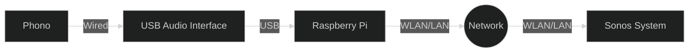

# phonos
**phonograph + sonos = phonos** 

Use your raspberry pi with an external USB soundcard to stream your phono to your Sonos system.  

## Setup
The setup consists of a phonogram which is connected to a raspberry pi using a usb-audio interface. This Raspberry pi is then connected with the same network as the Sonos system. 





## dependencies

* [ffmpeg](https://ffmpeg.org/)
* [alsa](https://www.alsa-project.org/wiki/Main_Page)
* [soco-cli](https://github.com/avantrec/soco-cli)

## configuration

In the Raspberry Pi use the aplay -L command to determine the alias for your usb-audio adapter. 
```bash

$> aplay -L
# ... 
hw:CARD=Headphones,DEV=0
    bcm2835 Headphones, bcm2835 Headphones
    Direct hardware device without any conversions
plughw:CARD=Headphones,DEV=0
    bcm2835 Headphones, bcm2835 Headphones
    Hardware device with all software conversions
sysdefault:CARD=Headphones
    bcm2835 Headphones, bcm2835 Headphones
    Default Audio Device
dmix:CARD=Headphones,DEV=0
    bcm2835 Headphones, bcm2835 Headphones
    Direct sample mixing device
usbstream:CARD=Headphones
    bcm2835 Headphones
    USB Stream Output
# ...
plughw:CARD=CODEC,DEV=0
    USB Audio CODEC, USB Audio
    Hardware device with all software conversions
# ...

# in my case I had to remember the 
# plughw:CARD=CODEC,DEV=0
# string. 

```

Install the soco-cli python package. 

```bash
# I reccomend using a venv
python3 -m venv .venv
source .venv/bin/activate
pip install soco-cli
```

## usage

now in a shell activate again the python venv

```bash
# activate the venv
source .venv/bin/activate
# read the current IP address of the wifi adapter into a variable (wlan0 - might be different in your case)
ipA=`ip -4 addr show wlan0 | grep -oP '(?<=inet\s)\d+(\.\d+){3}'`
# start ffmpeg to serve the input from your device to a http stream on port 5400: http://<your IP>:5400/stream.mp3
# note: here as input (-i) now reference your usb-audio-interface with the string taken from the configuration part.  
# note2: the ffmpeg command is sent to the background with "&"
ffmpeg -nostats -loglevel 0 -report  -nostdin -f alsa -i plughw:CARD=CODEC,DEV=0 -listen 1  -f mp3 http://$ipA:5400/stream.mp3 & 
# now start the playback on your Sonos using the soco-cli command "play-uri". 
# note: in my case the target room was "Büro". 
# the command looks like: sonos <your room> play_uri http://$ipA:5400/stream.mp3
sonos Büro play_uri http://$ipA:5400/stream.mp3
```
*hint: I put the above script in a cronjob with @reboot to start streaming as soon as I power-on my phonos system.* 

**enjoy.**